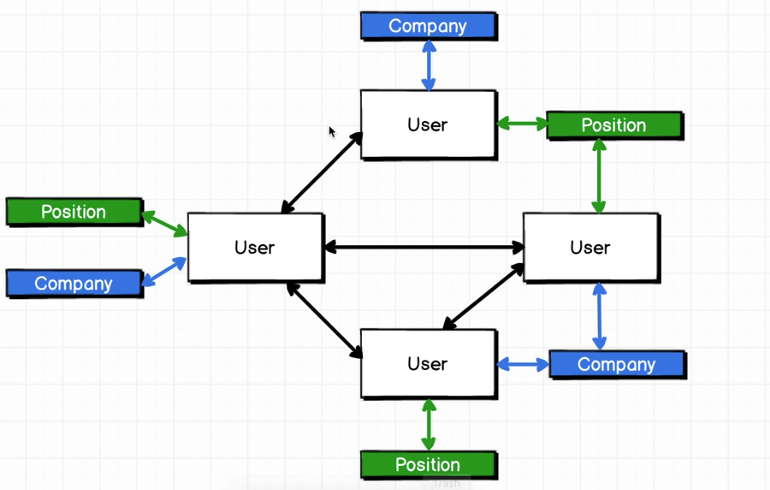

# GraphQL Overview

## What is it?
GraphQL thinks of the data being represented by a graph:


We're not saying that we're changing how the data will be stored in the db. 
We can still use whatever db since GraphQL is database-agnostic.

```js
query {
  user(id: '23') {
    // think of the below as walking to those nodes in the graph
    users(){
      company () {
        name
      }
    }
  }
}
```

## Working with GraphQL
Overall architecture of what we're going to build:

(Web Page (GraphiQL)) <-GraphQL Query-> Express/GraphQL Server <--> Datastore

GraphiQL: used solely for development; tool made by GraphQL team. allows us
to make queries against our development server.

Packages we installed for the `users` project:
* Express: handling http request and making responses
* Express-graphql: compatibility layer
* graphql: actual graphql used to crawl through the data
* lodash: utility package