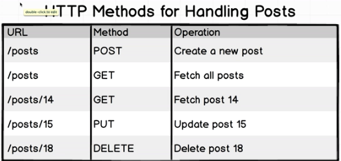

# RESTful Routing

## Review
GraphQL and Relay were created to solve a specific set of problems with GraphQL.

REST-ful Routing: Given a collection of records on a server, there should be 
a uniform URL and HTTP request method used to utilize that collection of records.

Let's talk about how to do a little more complicated example; for example,
if we have to get a list of posts associated with a specific user. We have to
start to nest the urls a little bit. If we want to make a get request for 
user 23's posts: `GET /users/23/posts`. If we want to fetch user 23's 14th post:
`GET /users/23/posts/14`.

## Shortcomings of REST-ful routing
Things start to get a little bit more weird with nested data types.

One way that we could solve the problem of having to write highly customized
endpoints is by doing something like this:

However, the above solution starts to break RESTful conventions.

Also have to be careful with the data being served bck to the client. For 
example, maybe you only wanted the company name, but then you might now be 
serving back everything about the company.

This is what GraphQL wants to fix.
